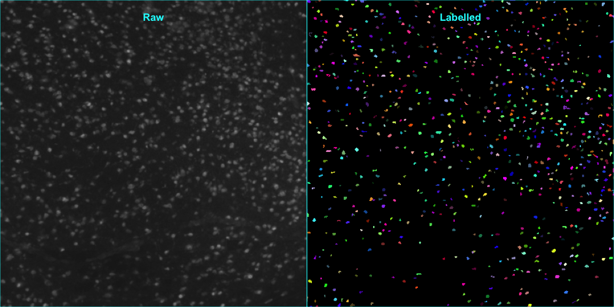

``` r
library(EBImage)
library(ggplot2)
library(cowplot)
library(magrittr)
library(TREXSeg)
```

Load data
---------

------------------------------------------------------------------------

To demonstrate the segmentation approach, we will look an
immunofluorscence image of the neuronal marker NeuN.

First, let’s crop out a smaller rectangle of the image to get a finer
detail of the cells. The images are stored as 16bit TIFFs so when
loading the data we can normalize the intensity values so that the
highest intensity values are close to 1. In the plot you can see all the
stained nuclei but it’s quite difficult to distinguish them from
autofluorescent speckles and background.

``` r
neun <- system.file("data", paste0("V13/neun.tif"), package = "TREXSeg")
neun.im <- readImage(files = neun)
neun.im <- EBImage::normalize(neun.im)

cat("Image dimensions: ", dim(neun.im))
```

    ## Image dimensions:  4464 4464

``` r
# Crop
neun.im <- neun.im[1500:2000, 1500:2000]
plot(neun.im)
title(main = "Raw", col.main = "cyan")
```


2D FFT filter
-------------

------------------------------------------------------------------------

Next we can apply a 2D convolution to blur the images and even out small
artifacts. The difference is quite subtle, but you should see that the
cells are a bit blurrier than in the previous image.

``` r
neun.im.filtered <- filter_cells(neun.im)

par(mfrow = c(1, 2), mar = c(0, 0, 0, 0))
plot(neun.im)
box(col = "cyan")
title(main = "Raw", col.main = "cyan", line = -2)
plot(neun.im.filtered)
title(main = "Filtered", col.main = "cyan", line = -2)
box(col = "cyan")
```


Correction
----------

------------------------------------------------------------------------

Using the raw image and the filtered image, we can now subtract the
blurry image from the raw image which makes the cells stand out much
clearer than before.

``` r
neun.im.corrected <- correct_cells(im = neun.im, imfiltered = neun.im.filtered)

par(mfrow = c(1, 2), mar = c(0, 0, 0, 0))
plot(neun.im)
title(main = "Raw", col.main = "cyan", line = -2)
box(col = "cyan")
plot(neun.im.corrected)
title(main = "Corrected", col.main = "cyan", line = -2)
box(col = "cyan")
```


Thresholding
------------

------------------------------------------------------------------------

Now that the cells are clearly distinguishable from the background, we
can apply a threshold to the corrected image to segment out the cells
nuclei. The thresholding method is a very simple mean + standard
deviation threshold, i.e. pixels with an intensity value higher than
mean(intensity) + nsd\*sd(intensity) are considered to come from cell
nuclei. The default value for nsd is 2, meaning that the threshold is
set 2 standard deviations above the mean. Setting a higher value of nsd
will result in fewer nuclei pixels and most of the time also fewer
and/or smaller cells.

``` r
neun.im.thresh <- threshold_cells(imcorrected = neun.im.corrected)

par(mfrow = c(1, 2), mar = c(0, 0, 0, 0))
plot(neun.im)
title(main = "Raw", col.main = "cyan", line = -2)
box(col = "cyan")
plot(neun.im.thresh)
title(main = "Thresholded", col.main = "cyan", line = -2)
box(col = "cyan")
```


Cleaning
--------

------------------------------------------------------------------------

You can see that there are quite a lot of small speckles left in the
image (and sometimes very big shapes as well) which we can remove by
cleaning out objects with a predefined area range. If we plot a histgram
of shape areas we can select a lower and upper bound for the allowed
shape sizes.

``` r
hist(table(bwlabel(neun.im.thresh))[-1], breaks = 30, main = "Histogram of shape areas", xlab = "pixel area")
```


``` r
neun.im.clean <- clean_cells(imthreshold = neun.im.thresh)

par(mfrow = c(1, 2), mar = c(0, 0, 0, 0))
plot(neun.im)
title(main = "Raw", col.main = "cyan", line = -2)
box(col = "cyan")
plot(neun.im.clean)
title(main = "Cleaned", col.main = "cyan", line = -2)
box(col = "cyan")
```


Watershed
---------

------------------------------------------------------------------------

Sometimes multiple nuclei are merged together because they are closely
packed. The watershed algorithm makes it possible to separate some of
these merged nuclei. After running the watershed step, we have segmented
cells each and each cell is labelled with a unique ID. Note that if you
run `bwlabel`, you will effect of the watershedding and change the cell
labels.

``` r
neun.im.watershed <- watershed_cells(imclean = neun.im.clean)

par(mfrow = c(1, 2), mar = c(0, 0, 0, 0))
plot(neun.im)
box(col = "cyan")
title(main = "Raw", col.main = "cyan", line = -2)
plot(colorLabels(neun.im.watershed))
box(col = "cyan")
title(main = "Labelled", col.main = "cyan", line = -2)
```



Data
====

------------------------------------------------------------------------

We can now run the whole workflow using the `SegmentCells` function. To
demonstrate the workflow we have a test dataset including
Immunofluoresence imaging of Egfp, Neun and Olig2 for a total of four
tissue sections.

``` r
# list input files
channels <- c("egfp", "neun", "olig2")
img.files <- setNames(system.file("data", paste0("V13/", channels, ".tif"), package = "TREXSeg"), nm = channels)
```

The threshold ranges used for the cleaning step can be adjusted for each
target. You can also use a predefine “crop window” if you want to run
the segmentation on a smaller part of the image.

NOTE: All images used here have a size of approximatly 4400\*4400
pixels. If you run the segmentation on higher resolution images you
should adjust the filters and to values that are appropriate for the
nuclei sizes.

``` r
# define feature threshold ranges
feature.thresholds <- list(neun = c(5, 40), 
                           olig2 = c(8, 40), 
                           egfp = c(5, 40))

# read images and run segmentation for each channel
segmented.list <- setNames(lapply(seq_along(img.files), function(i) {
  target <- names(img.files)[i]
  SegmentCells(
    impath = img.files[i], 
    crop.window = c(3000, 3500, 2500, 3000),
    feature.threshold = feature.thresholds[[target]], 
    verbose = TRUE)
}), nm = c("egfp", "neun", "olig2"))
```

Now we can plot the segmented nuclei for any of the four sections. We
can for example encode olig2, egfp and neun are RGB colors to visualize
them simultaneously.

Below the oligodendocytes are colored red, Egfp+ nuclei green and
Neurons blue. There are also a few nuclei which are olig2+Egfp+ (yellow)
or NeuN+Egfp+ (cyan).

``` r
im <- rgbImage(red = segmented.list$olig2, 
               green = segmented.list$egfp,
               blue = segmented.list$neun)
plot(im)
title(main = "red : Oligodendrocytes, green : Egfp, blue : Neurons", col.main = "cyan")
```


Count detected nuclei
---------------------

------------------------------------------------------------------------

Now we have segmented nuclei Egfp, Neun and Olig2 from four tissue
sections. We can count the number of detected nuclei using the `table`
function. Applying `table` on the segmented output will count the number
of pixels of each set of “connected” pixels, i.e. cells which is equal
to the pixel area. We remove the first element of the ouput from `table`
which is the area of the background.

``` r
for (s in names(segmented.list)) {
  segmented <- segmented.list[[s]]
  cat("Total number of oligodendrocytes in ", s, ": ", length(table(segmented.list$olig2[-1])), "\n")
  cat("Total number of EGFP in ", s, ": ", length(table(segmented.list$egfp[-1])), "\n")
  cat("Total number of neurons in ", s, ": ", length(table(segmented.list$neun[-1])), "\n\n")
}
```

    ## Total number of oligodendrocytes in  egfp :  303 
    ## Total number of EGFP in  egfp :  90 
    ## Total number of neurons in  egfp :  836 
    ## 
    ## Total number of oligodendrocytes in  neun :  303 
    ## Total number of EGFP in  neun :  90 
    ## Total number of neurons in  neun :  836 
    ## 
    ## Total number of oligodendrocytes in  olig2 :  303 
    ## Total number of EGFP in  olig2 :  90 
    ## Total number of neurons in  olig2 :  836

Find overlapping cells
----------------------

------------------------------------------------------------------------

If we want to detect nuclei with overlapping signals from two channels,
we can run `OverlapImages`.

``` r
im <- rgbImage(green = segmented.list$egfp, 
               blue = segmented.list$neun)
par(mar = c(0, 0, 0, 0))
plot(im)

olig2_neun <- OverlapImages(segmented.list$egfp, segmented.list$neun) 
title(main = "green : Egfp, blue : Neurons, cyan : Egfp+ Neurons", col.main = "cyan", line = -2)
```


The `OverlapImages` function makes sure that only nuclei with a minimum
predefined overlap (at least 50% of the smallest area) are kept.

``` r
par(mfrow = c(1, 3), mar = c(0, 0, 0, 0))
plot(segmented.list$egfp)
box(col = "cyan")
title(main = "Egfp", col.main = "cyan", line = -2)
plot(segmented.list$neun)
box(col = "cyan")
title(main = "NeuN", col.main = "cyan", line = -2)
plot(olig2_neun)
box(col = "cyan")
title(main = "Overlapping Egfp and Neun", col.main = "cyan", line = -2)
```


Count Egfp+ nuclei
------------------

------------------------------------------------------------------------

We can extract different features from the segmented nuclei using the
`computeFeatures` methods from EBImage.

``` r
par(mfrow = c(1, 2))

# x, y coordinates
xy.coords <- computeFeatures.moment(x = olig2_neun)
plot(xy.coords[, c("m.cx", "m.cy")], pch = 19)
title(main = "nuclei positions")

# shape features
shape.fts <- computeFeatures.shape(x = olig2_neun)
boxplot(shape.fts[, "s.area"])
title(main = "nuclei areas [number of pixels]")
```


